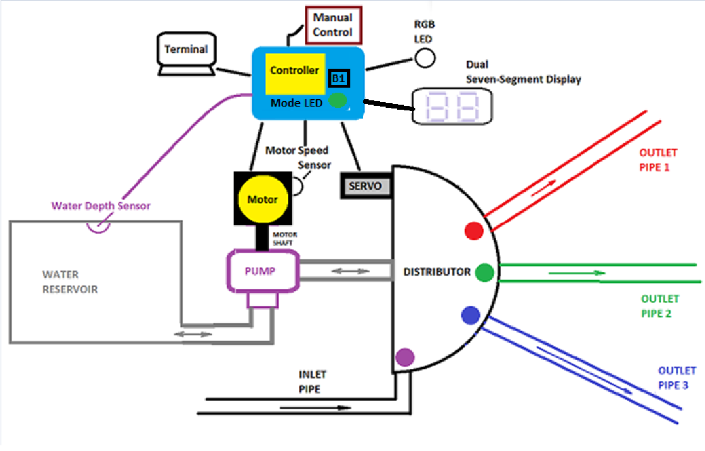
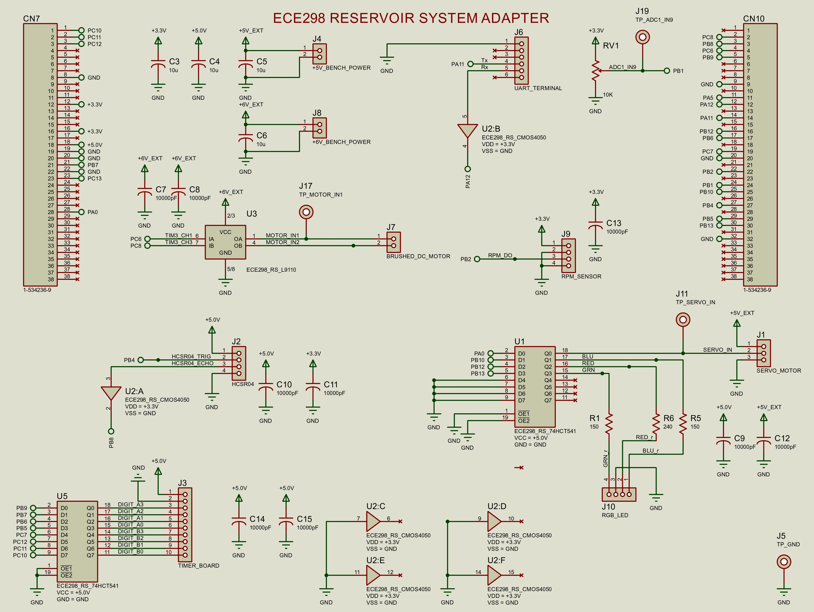
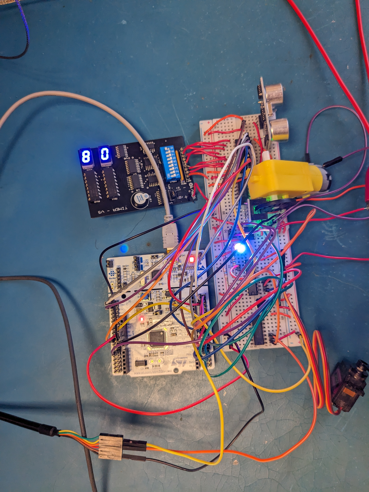

# Water Reservoir System

This Water Reservoir System is an embedded project designed to pump water to three different zones over the course of 24 hours, based on user input.

The user may specify start and stop times for the inlet pipe, pipes for zones 1, 2, and 3, in addition to specifying motor speeds controlling the rate of water distribution to each zone. We allow manual control of motor speed if specified by the user via a potentiometer. If the water reservoir is empty at any point during a run, the system halts, flashes white on the LED, and waits for a reset. 

The system features a terminal to display time, current zone, motor PWM, motor RPM, and water depth. A high-level design demonstrates the system:

Credit: ECE 298 Instructors

The following image is the schematic of the system:

Below is a video demonstration of the reservoir system running:

https://youtu.be/qclSO8EKO9s

Top Down View:

